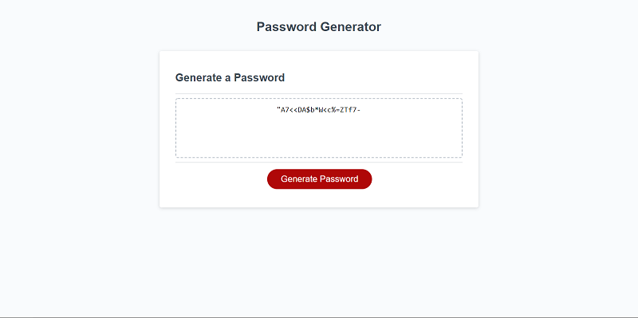

# Password-Generator

For this assignment, I was tasked with creating an application that enables users to generate random passwords based on criteria that they’ve selected from a series of questions they are presented. Javascript was utilized to generate the launch the questions / prompts, and to generate the final password. Below is the criteria the user is presented with

    * How many characters would the user like the password to be. Must be a number from 8-128
    * Would they like the password to contain uppercase characters (A-Z)
    * Would they like the password to contain lowercase characters (a-z)
    * Would they like the password to contain numbers (0-9)
    * Would they like the password to contain special characters (`!@#$%^&*()-_+={}[]|\\:;<>./?)

4 arrays are created based on the above. Based on the answers, an empty array is filled with all possible characters. In order to ensure that at least 1 character from each of the selections the user has made makes it into the final password, a 2nd empty array is filled with 1 random character from each of their selections. For the final password, random characters are grabbed from the array with all possible characters and pushed to an empty final array. This array is equal to the length of the password the user desires - the number of items in the required characters array. Then, the final password array is concatenated with the required characters array, and converted to a string. This string appears on the users screen in the text area.

## Deployed Application Link:

https://bahuisken.github.io/Password-Generator/

## Screenshots

- Mobile

- Desktop

## License

No License
